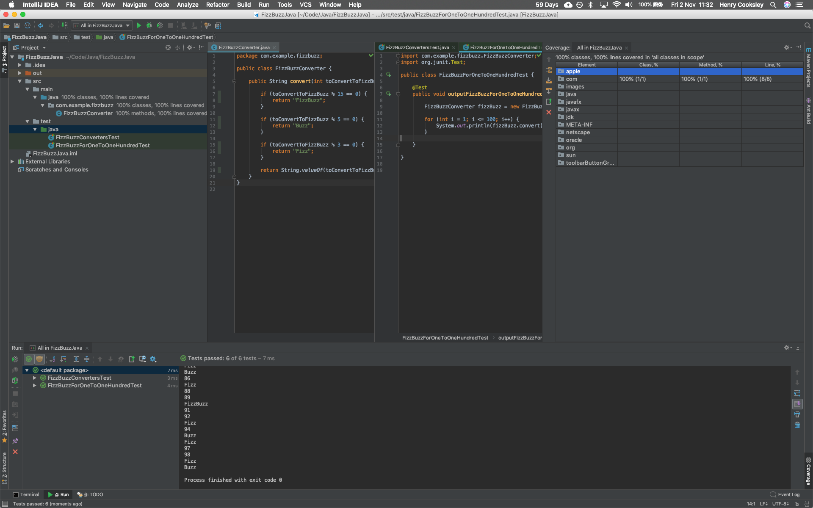

# FizzBuzzJava

## User Stories

```
// Write a program that prints the numbers from 1 to 100.
// But for multiples of three print "Fizz" instead of the number
// and for the multiples of five print "Buzz".
// For numbers which are multiples of both three and five print "FizzBuzz"
```

## Screenshot


## Test coverage
100% lines covered in 'all classes in scope'

## How to use

### To set up the project

Clone this repository and then open in IntelliJ IDEA or your IDE of choice.
